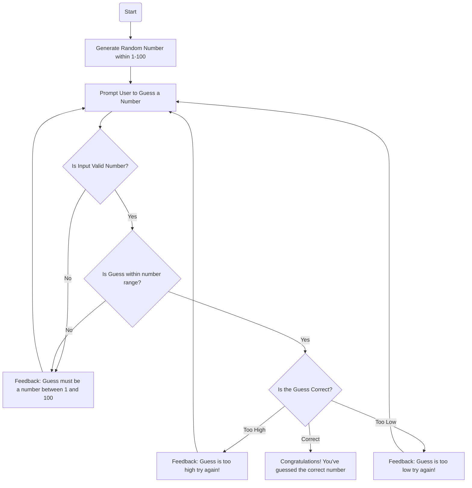

# Random Generator Guessing Game.mb

The process begins with the Start node, setting the stage for the game's logic.
Generate Random Number:

The computer generates a random number within a specified range, in this case, between 1 and 100. This is represented by the node labeled Generate Random Number within 1-100.
Prompt User to Guess a Number:

The user is prompted to input their guess. This step is illustrated by the node Prompt User to Guess a Number.
Input Validation:

The input is checked to ensure it is a numeric value within the established boundaries (1-100). If the input is not valid, feedback is given, and the user is prompted again.
Decision nodes are used to determine if the input is valid (Is Input Valid Number?) and if it's within the specified range (Is Guess within number range?).
If the input is invalid, Feedback: Guess must be a number between 1 and 100 is provided.
Compare Guess:

Once a valid guess is received, the game checks if the guess is correct using the decision node Is the Guess Correct?.
Feedback:

Based on the comparison, one of three feedback messages is provided:
Feedback: Guess is too high if the guess is higher than the random number.
Feedback: Guess is too low if the guess is lower.
Congratulations! You've guessed the correct number if the guess matches the random number.
Repeat or End:

If the guess is incorrect (either too high or too low), the user is prompted again to guess, repeating the process.
If the guess is correct, the game ends.
The flowchart effectively guides the logic from initializing the game, through user interaction and input validation, to finally checking the result against the correct random number.

This markdown description clarifies each part of the flowchart, helping readers understand the game's workflow and logic in a step-by-step manner.
