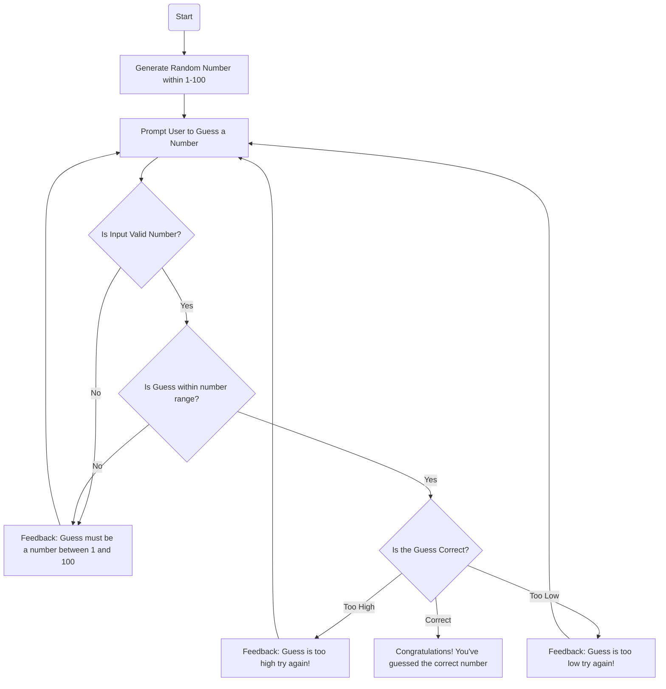

# Guessing.mb

```mermaid
flowchart TD
    A(Start) --> B[Generate Random Number within 1-100]
    B --> C[Prompt User to Guess a Number]
    C --> D{Is Input Valid Number?}
    D -->|No| C3[Feedback: Guess must be a number between 1 and 100]
    D -->|Yes| E{Is Guess within number range?}
    E -->|No| C3
    E -->|Yes| F{Is the Guess Correct?}
    F -->|Too High| C1[Feedback: Guess is too high try again!]
    F -->|Too Low| C2[Feedback: Guess is too low try again!]
    F -->|Correct| G[Congratulations! You've guessed the correct number]
    C1 --> C
    C2 --> C
    C3 --> C
```
